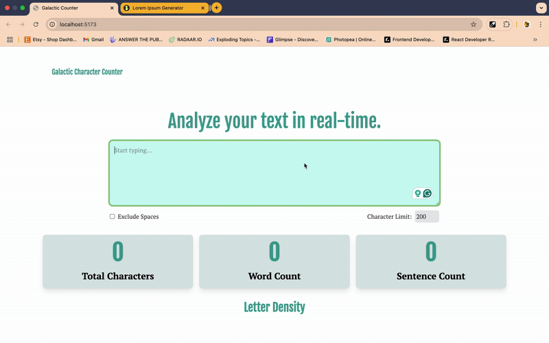

Galactic Word Counter 🚀🪐

A sci-fi inspired text analyzer that dynamically counts characters, words, and sentences in real-time.

📜 Overview

The Galactic Word Counter is a minimalist yet powerful  little tool that: ✅ Counts characters, words, and sentences dynamically.

✅ Excludes spaces from character count.
✅ Estimates reading time for the given text.
✅ Provides a clean, intuitive UI for quick text analysis.

🛠️ Tech Stack

Built using:
•	React ⚛️ (Component-based UI)
•	Tailwind CSS 🎨 (Utility-first styling)
•	React Hooks 🪝 (useState & useEffect for state management)
•	Vite ⚡ (For a fast development experience)

🎯 The Process

1️⃣ Initial Vision:

The project started as a Star Wars-inspired UI, featuring a dynamic dark vs light mode toggle (Jedi vs Sith themes). However, as development progressed, a key realization was made:

🔹 Simplification is key.

Instead of focusing on extra features, the project pivoted toward completing the core functionality first before worrying about advanced theming.

2️⃣ Key Features & Challenges
✅ Built a responsive UI (mobile-first approach).
✅ Implemented state management for dynamic counting.
✅ Excluded spaces, symbols & numbers for accurate character analysis.
✅ Ensured accessibility & usability.
✅ Prioritized completion over complexity.
 

•	App.jsx → Manages state & renders components.
•	TextArea.jsx → Text input & real-time updates.
•	StatTiles.jsx → Displays character, word & sentence counts.
•	LetterDensity.jsx → Analyzes letter frequency.
•	Toggle.jsx → (Unimplemented, left for potential future themes.)
 
🎨 Why I Removed Theme Switching
Originally, the project included Jedi vs Sith themes. However, through iteration, it became clear that:
•	Prioritizing core functionality over aesthetic complexity was more beneficial.
•	Users benefit from simplicity & ease of use over theme toggling.
•	The option remains open for future improvements with the existing Toggle component.
🎯 Key Takeaway: "It’s better to finish a functional project than get stuck chasing unnecessary perfection."
 
💡 Future Enhancements:

🔹 Reintroduce theme switching when necessary.
🔹 Add text-to-speech integration for accessibility.
🔹 Improve animations & transitions for a smoother UX.
🔹 Expand text analytics (reading time, most used words, etc.).

This project serves as a great example of balancing learning, efficiency, and practicality. 

